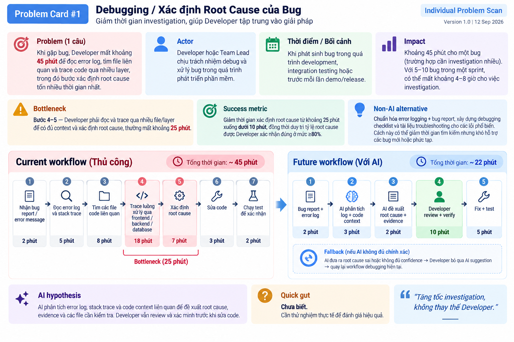
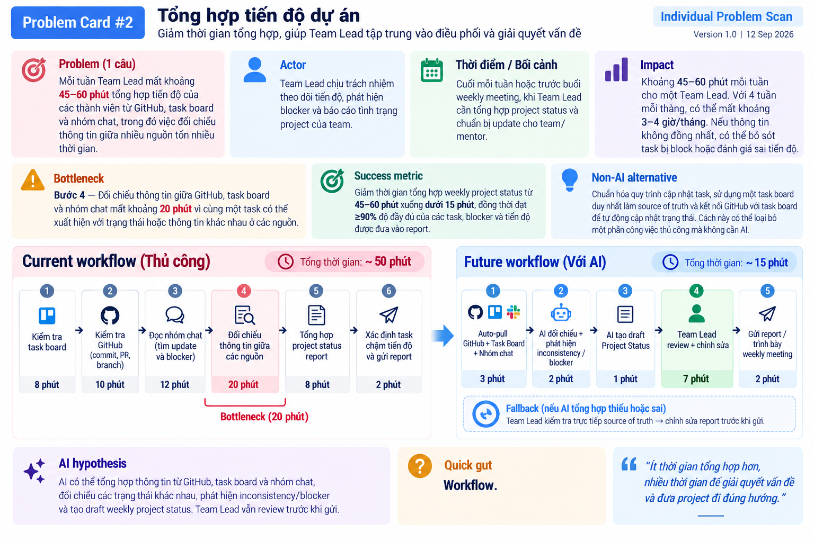
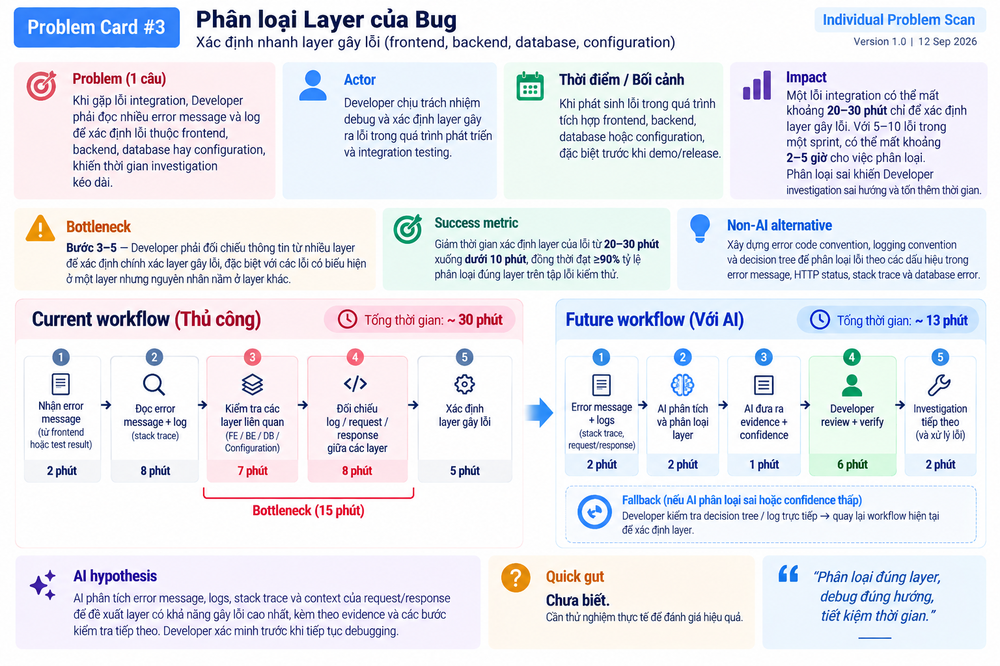

# 01 — Individual Problem Scan

> Điền theo Phase 1 + Phase 2 trong `01-worksheet.md`. Tự scan trước, dùng AI sau để phản biện. Không copy ví dụ Weekly Report.

## Thông tin cá nhân

- Họ và tên: Đặng Văn Thái Anh
- Mã học viên: 2A202602407
- Vai trò / bối cảnh (VD: sinh viên năm X, intern PM, ...): Sinh viên năm cuối ngành software engineering, tham gia chương trình đào tạo AI; đồng thời là Team Lead/BA và developer trong các dự án phần mềm học thuật.
- Công việc hằng tuần (3-5 gạch đầu dòng để soi problem):
Phân tích yêu cầu, chia nhỏ task và theo dõi tiến độ cho các thành viên trong team dự án.
Thiết kế/kiểm tra workflow, use case, SRS/SDD và chuyển yêu cầu nghiệp vụ thành task có thể implement.
Lập trình và review code, xử lý bug, kiểm tra integration giữa các module và đảm bảo các feature hoạt động end-to-end.
Làm việc với Git/GitHub, quản lý branch, commit, merge và kiểm tra thay đổi của team.
Học và thử nghiệm các công nghệ AI/LLM, tìm cách ứng dụng AI vào các workflow thực tế thay vì chỉ xây chatbot.
---

## Phase 1 — Scan 5+ problems (tối thiểu 5, khuyến khích 8-10)

**Cách điền:** mỗi dòng = việc gì + ai chịu + đo bằng gì. Cột `Dấu hiệu thật` bắt buộc có số: mất bao lâu (bấm giờ mấy lần), mấy lần/tuần, bao nhiêu người gặp, log/ticket/quote nào.

| #  | Lăng kính (Lặp lại / Tốn thời gian / AI có thể tốt hơn / Pain từ người khác) | Problem quan sát được                                                                                    | Ai chịu ảnh hưởng?        | Dấu hiệu thật (số + bằng chứng)                             |
| -- | ---------------------------------------------------------------------------- | -------------------------------------------------------------------------------------------------------- | ------------------------- | ----------------------------------------------------------- |
| 1  | Lặp lại                                                                      | Mỗi tuần phải tổng hợp tiến độ của các thành viên từ GitHub, task board và nhóm chat                     | Team Lead, các thành viên | Mất khoảng 30–60 phút/lần                                   |
| 2  | Lặp lại                                                                      | Mỗi tuần phải kiểm tra branch, commit và pull request của từng thành viên để xác định task đã hoàn thành | Team Lead, Developer      | Phải kiểm tra 5 thành viên và nhiều branch/PR               |
| 3  | Tốn thời gian                                                                | Đọc và rà soát SRS/SDD/use case trước khi chuyển yêu cầu thành implementation task                       | BA, Developer, Team Lead  | Tài liệu thường dài 10–30 trang, mất 30–60 phút/lần         |
| 4  | Tốn thời gian                                                                | Phân tích một feature lớn và chia thành các task nhỏ có thể implement                                    | BA, Developer             | Một feature thường phải chia thành 5–10 task                |
| 5  | AI có thể tốt hơn                                                            | Khi gặp bug phải đọc error log và nhiều file code để tìm nguyên nhân ban đầu                             | Developer, Team Lead      | Một bug thường mất 30–60 phút để xác định root cause        |
| 6  | AI có thể tốt hơn                                                            | Tìm lại quyết định kiến trúc, convention hoặc cách implement đã thống nhất trong các cuộc trao đổi trước | Developer, Team Lead      | Mất khoảng 10–20 phút/lần tìm hoặc phải hỏi lại team        |
| 7  | Pain từ người khác                                                           | Thành viên hiểu khác yêu cầu nên implementation không đúng với expectation ban đầu                       | Developer, BA, Team Lead  | Phải giải thích hoặc sửa task 1–2 lần/feature               |
| 8  | Pain từ người khác                                                           | Team Lead phải chủ động nhắc thành viên cập nhật task và tiến độ                                         | Team Lead, các thành viên | Có thể phải follow-up 2–3 lần/sprint                        |
| 9  | Tốn thời gian                                                                | Trước khi demo phải kiểm tra nhiều feature end-to-end để phát hiện lỗi integration                       | Team Lead, Developer      | Regression/manual testing mất khoảng 1–2 giờ trước mỗi demo |
| 10 | Lặp lại                                                                      | Mỗi ngày phải tổng hợp việc đã làm, việc đang làm và blocker để cập nhật standup                         | Team Lead, Developer      | Mất khoảng 5–10 phút/ngày                                   |


> Gợi ý tự soi: tuần trước mất nhiều thời gian nhất vào việc gì? Việc gì hay trì hoãn? Người khác hay hỏi lại câu gì? Workflow nào ai cũng biết là chậm?

**AI đã dùng ở Phase 1 (nếu có):**
- Prompt đã hỏi: tôi là sinh viên năm cuối ngành Sorfware Enggineer, đang tham gia chương trình đào tạo AI/Codelab và có kinh nghiệm làm Team Lead/BA/Developer trong các dự án phần mềm hãy cho tôi 15 Individual Problem với fomart 
| # | Lăng kính (Lặp lại / Tốn thời gian / AI có thể tốt hơn / Pain từ người khác) | Problem quan sát được | Ai chịu ảnh hưởng? | Dấu hiệu thật (số + bằng chứng) | |---|---|---|---|---| | 1 | | | | | | 2 | | | | | | 3 | | | | | | 4 | | | | | | 5 | | | | | | 6 | | | | | | 7 | | | | | | 8 | | | | | | 9 | | | | | | 10 | | | | |
- Ý dùng được:
- Ý bỏ vì không phải pain thật: Thành viên commit code nhưng message hoặc PR description không mô tả rõ thay đổi, khiến việc review khó khăn
Khi một thành viên bị blocker, Team Lead chỉ biết sau khi hỏi trực tiếp hoặc kiểm tra tiến độ

**Self-check Phase 1:**
- [ ] Đủ 5+ dòng, mỗi dòng có actor + số đo cụ thể
- [ ] Dùng ít nhất 3/4 lăng kính
- [ ] Không có dòng chung chung kiểu "mất nhiều thời gian"

---

## Phase 2 — Top 3 Problem Cards

### 2.1. Chọn top 3

Giữ bài nào: actor cụ thể, workflow vẽ được 3-7 bước, bottleneck ở 1 bước, impact đo được. Loại bài quá rộng.

| Rank | Problem (copy từ bảng scan) | Vì sao chọn (2-3 ý) | Điều còn chưa chắc |
|---|---|---|---|

| 1    | **Khi gặp bug phải đọc error log và nhiều file code để tìm nguyên nhân ban đầu**                                      | Actor rõ: Developer/Team Lead. Workflow có thể vẽ 5–7 bước từ nhận bug → đọc log → trace code → xác định nguyên nhân → sửa → test. Bottleneck tập trung ở bước tìm root cause và có thể đo thời gian debug. | AI có thực sự xác định root cause chính xác hơn developer không; cần xác định loại bug và phạm vi dữ liệu đầu vào.               |
| 2    | **Mỗi tuần phải tổng hợp tiến độ của các thành viên từ GitHub, task board và nhóm chat**                              | Actor rõ: Team Lead. Workflow lặp lại hàng tuần và có nhiều nguồn dữ liệu nhưng quy trình khá rõ. Có thể đo thời gian tổng hợp trước/sau và mức độ đầy đủ của report.                                       | Cần xác định chính xác các nguồn dữ liệu và liệu API/tool tự động có thể giải quyết phần lớn workflow mà không cần AI hay không. |
| 3    | **Phải đọc nhiều error message và log khác nhau để xác định lỗi thuộc frontend, backend, database hay configuration** | Actor rõ: Developer. Workflow 3–7 bước, bottleneck nằm ở bước phân loại layer/root cause. Có thể đo thời gian xác định layer của lỗi và tỷ lệ phân loại đúng.                                               | Cần kiểm chứng dataset lỗi đủ đa dạng và xác định liệu Rule/Workflow đơn giản đã đủ tốt hay AI thực sự tạo thêm giá trị.         |


### 2.2. Problem Cards chi tiết (lặp lại cho cả 3 cards)

---

#### Problem Card #1 — Khi gặp bug, Developer phải đọc error log và trace qua nhiều file code để xác định nguyên nhân ban đầu

```text
Problem 1 câu:
Khi gặp bug, Developer phải đọc error log và trace qua nhiều file code để xác định nguyên nhân ban đầu, khiến thời gian debug kéo dài.

Actor:
Developer / Team Lead trong quá trình phát triển và kiểm thử phần mềm.

Thời điểm / bối cảnh:
Khi phát sinh bug trong quá trình development, integration testing hoặc trước khi demo/release.

Current workflow 3-7 bước:
1. Nhận bug report hoặc error message.
2. Đọc error log / stack trace để xác định vị trí lỗi.
3. Tìm và đọc các file code liên quan.
4. Trace luồng xử lý giữa các layer.
5. Xác định root-cause hypothesis.
6. Sửa code và chạy lại test.

Bottleneck:
Bước 3-5: Developer phải tìm kiếm, đọc và trace nhiều file code
để có đủ context và xác định root cause ban đầu.

Impact:
Mỗi bug có thể mất khoảng 30-60 phút để investigation và xác định
nguyên nhân ban đầu. Với nhiều bug trong một sprint, thời gian debug
có thể chiếm vài giờ và phụ thuộc nhiều vào kinh nghiệm của Developer.

Success metric:
Giảm thời gian từ lúc nhận bug đến khi xác định được root cause
từ 30-60 phút xuống dưới 15-20 phút, đồng thời duy trì tỷ lệ
root cause được xác định đúng >= 80%.

Non-AI alternative:
Chuẩn hóa bug report, error code và logging; xây dựng debugging
checklist và tài liệu troubleshooting cho các lỗi phổ biến.

AI hypothesis:
AI nhận error log, stack trace và code context liên quan để phân tích,
đề xuất root-cause hypothesis, evidence và các file cần kiểm tra.
Developer vẫn review và xác minh trước khi sửa code.

Quick gut:
[ ] No AI / process fix
[x] Rule
[x] Workflow
[ ] Agent
```

**Draft workflow Card #1** (ASCII / Mermaid / ảnh đính kèm):

```text
CURRENT STATE — 30–60 phút

[1 Nhận bug report/error: ~2']
   → [2 Đọc log / stack trace: ~5']
   → [3 Tìm & đọc các file code liên quan: ~15']
   → [4 Trace luồng giữa các layer: ~15']
   → [5 Đề xuất root-cause hypothesis: ~10']
   → [6 Sửa code & chạy lại test: ~8–13']
            <-- bottleneck ở bước 3–5 (tìm/đọc/trace code)


FUTURE STATE — 15–20 phút

[1 Dán log + stack trace + chọn file context: ~3']
   → [2 AI phân tích → root-cause hypothesis
          + evidence + danh sách file cần kiểm tra: ~5']
   → [3 Developer review/verify hypothesis & evidence: ~5']   <-- human boundary
   → [4 Sửa code & chạy test: ~7']


Fallback: nếu AI sai / không trả hypothesis / thiếu confidence
   → Developer quay lại workflow hiện tại (đọc log thủ công → tìm file
     → trace giữa các layer) và ghi lại case vào log để cải thiện prompt
     hoặc bổ sung code context cho lần sau.
   → Nếu AI trả hypothesis rỗng/không có evidence → DỪNG, KHÔNG sửa
     code dựa trên kết quả chưa xác minh; báo lỗi về prompt/nguồn dữ liệu.
   → Nếu AI đề xuất root cause sai (Developer xác minh bằng test/reproduce
     mà không khớp) → fallback sang tìm thủ công và thêm case này vào
     bộ test regression để đánh giá lại model.
```

File đính kèm (nếu vẽ riêng): 


---

#### Problem Card #2 — Tổng hợp tiến độ dự án

```text
Problem 1 câu:
Mỗi tuần Team Lead mất khoảng 45–60 phút tổng hợp tiến độ của các
thành viên từ GitHub, task board và nhóm chat, trong đó việc đối chiếu
thông tin giữa nhiều nguồn tốn nhiều thời gian.

Actor:
Team Lead chịu trách nhiệm theo dõi tiến độ, phát hiện blocker và
báo cáo tình trạng project của team.

Thời điểm / bối cảnh:
Cuối mỗi tuần hoặc trước buổi weekly meeting, khi Team Lead cần tổng
hợp project status và chuẩn bị update cho team/mentor.

Current workflow 3-7 bước:
1. Kiểm tra task board để xem task Done / In Progress / Blocked
2. Kiểm tra GitHub để xem commit, branch và pull request
3. Đọc nhóm chat để tìm các update và blocker của thành viên
4. Đối chiếu thông tin giữa các nguồn
5. Tổng hợp thành project status report
6. Xác định task chậm tiến độ và blocker
7. Gửi report / trình bày trong weekly meeting

Bottleneck:
Bước 4 — đối chiếu thông tin giữa GitHub, task board và nhóm chat mất
khoảng 20 phút vì cùng một task có thể xuất hiện với trạng thái hoặc
thông tin khác nhau ở các nguồn.

Impact:
Khoảng 45–60 phút mỗi tuần cho một Team Lead. Với 4 tuần mỗi tháng,
có thể mất khoảng 3–4 giờ/tháng chỉ để tổng hợp tiến độ. Nếu thông
tin giữa các nguồn không đồng nhất, Team Lead có thể bỏ sót task bị
block hoặc đánh giá sai tiến độ.

Success metric:
Giảm thời gian tổng hợp weekly project status từ 45–60 phút xuống dưới
15 phút, đồng thời đạt ≥ 90% độ đầy đủ của các task, blocker và tiến
độ được đưa vào report.

Non-AI alternative:
Chuẩn hóa quy trình cập nhật task, sử dụng một task board duy nhất
làm source of truth và kết nối GitHub với task board để tự động cập
nhật trạng thái. Cách này có thể loại bỏ một phần công việc thủ công
mà không cần AI.

AI hypothesis:
AI có thể tổng hợp thông tin từ GitHub, task board và nhóm chat, đối
chiếu các trạng thái khác nhau, phát hiện inconsistency/blocker và
tạo draft weekly project status. Team Lead vẫn review trước khi gửi.

Quick gut:
[ ] No AI / process fix
[ ] Rule
[x] Workflow
[ ] Agent
[ ] Chưa biết
```

**Draft workflow Card #2:**

```text
CURRENT STATE — 50 phút

[1 Kiểm tra Task Board: ~8']
   → [2 Kiểm tra GitHub: ~10']
   → [3 Đọc nhóm chat: ~12']
   → [4 Đối chiếu 3 nguồn: ~20']   <-- bottleneck
   → [5 Tổng hợp Status Report: ~8']
   → [6 Review + gửi: ~2']


FUTURE STATE — 15 phút

[1 Auto-pull GitHub + Task Board + Chat: ~3']
   → [2 AI đối chiếu + phát hiện inconsistency/blocker: ~2']
   → [3 AI tạo draft Project Status: ~1']
   → [4 Team Lead review + chỉnh sửa: ~7']   <-- human boundary
   → [5 Gửi report: ~2']


Fallback:
- Nếu AI tổng hợp thiếu task/blocker hoặc phát hiện sai trạng thái
  → Team Lead kiểm tra trực tiếp source of truth (GitHub, Task Board,
    Chat), chỉnh sửa report trước khi gửi.
- Nếu AI không pull được dữ liệu từ một nguồn (lỗi API, thiếu quyền)
  → tự động đánh dấu nguồn bị miss trong report, Team Lead bổ sung
    thủ công cho nguồn đó.
- Nếu AI detect inconsistency nhưng Team Lead xác minh là sai (ví dụ
  task đã update trên chat nhưng chưa sync sang board) → bổ sung rule
  vào playbook để giảm false positive cho lần sau.
```

File đính kèm: 

---

#### Problem Card #3 — Phân loại Layer của Bug

```text
Problem 1 câu:
Khi gặp lỗi integration, Developer phải đọc nhiều error message và log
để xác định lỗi thuộc frontend, backend, database hay configuration,
khiến thời gian investigation kéo dài.

Actor:
Developer chịu trách nhiệm debug và xác định layer gây ra lỗi trong
quá trình phát triển và integration testing.

Thời điểm / bối cảnh:
Khi phát sinh lỗi trong quá trình tích hợp frontend, backend, database
hoặc configuration, đặc biệt trước khi demo/release.

Current workflow 3-7 bước:
1. Nhận error message từ frontend hoặc test result
2. Kiểm tra log và stack trace
3. Xác định các component/layer có liên quan
4. Đối chiếu request/response và log giữa các layer
5. Xác định lỗi thuộc frontend, backend, database hoặc configuration
6. Chuyển sang investigation và xử lý lỗi

Bottleneck:
Bước 3–5 — Developer phải đối chiếu thông tin từ nhiều layer để xác
định chính xác layer gây lỗi, đặc biệt với các lỗi có biểu hiện ở một
layer nhưng nguyên nhân nằm ở layer khác.

Impact:
Một lỗi integration có thể mất khoảng 20–30 phút chỉ để xác định layer
gây lỗi trước khi bắt đầu xử lý. Với 5–10 lỗi integration trong một
sprint, thời gian phân loại có thể chiếm khoảng 2–5 giờ. Phân loại sai
cũng khiến Developer investigation sai hướng và phải quay lại kiểm tra
các layer khác.

Success metric:
Giảm thời gian xác định layer của lỗi từ khoảng 20–30 phút xuống dưới
10 phút, đồng thời đạt ≥ 90% tỷ lệ phân loại đúng layer trên tập lỗi
kiểm thử.

Non-AI alternative:
Xây dựng error code convention, logging convention và decision tree để
phân loại lỗi theo các dấu hiệu trong error message, HTTP status, stack
trace và database error.

AI hypothesis:
AI phân tích error message, logs, stack trace và context của request/
response để đề xuất layer có khả năng gây lỗi cao nhất, kèm theo
evidence và các bước kiểm tra tiếp theo. Developer xác minh trước khi
tiếp tục debugging.


```

**Draft workflow Card #3:**

```text
CURRENT STATE — 30 phút

[1 Nhận error từ frontend/test: ~2']
   → [2 Đọc error message + log + stack trace: ~8']
   → [3 Kiểm tra các component/layer liên quan: ~7']
   → [4 Đối chiếu log/request/response giữa các layer: ~8']   <-- bottleneck
   → [5 Xác định layer gây lỗi: ~5']
   → [6 Chuyển sang investigation/xử lý lỗi (ngoài phạm vi card)]


FUTURE STATE — 13 phút

[1 Cung cấp error message + logs + stack trace cho AI: ~2']
   → [2 AI phân tích và phân loại layer nghi ngờ: ~2']
   → [3 AI đưa evidence + confidence score + bước verify: ~1']
   → [4 Developer review + verify trên system thật: ~6']   <-- human boundary
   → [5 Chuyển sang investigation sâu ở layer đã xác định: ~2']


Fallback:
- Nếu AI phân loại sai layer (Developer verify trên system thật mà
  không khớp) → quay lại workflow hiện tại: kiểm tra decision tree,
  đọc log thủ công, đối chiếu cross-layer. Ghi lại case để cập nhật
  prompt và bổ sung mẫu log mới.
- Nếu AI confidence thấp hoặc trả nhiều layer ngang nhau → Developer
  dùng decision tree/log trực tiếp để chốt layer; không tự ý chọn
  theo AI để tránh investigation sai hướng.
- Nếu thiếu log/stack trace (ví dụ chỉ có error message) → AI yêu
  cầu Developer bổ sung context (endpoint, payload, request ID) trước
  khi phân loại; không suy đoán layer khi thiếu evidence.
```

File đính kèm: File đính kèm: 

---

### 2.3. Card muốn pitch nhất (chuẩn bị 2 phút)

**Card tôi muốn pitch nhất:**

Problem #2 — Tổng hợp tiến độ dự án

Mỗi tuần Team Lead mất khoảng 45–60 phút tổng hợp tiến độ
của các thành viên từ GitHub, task board và nhóm chat.
Bottleneck nằm ở bước đối chiếu thông tin giữa các nguồn,
vì cùng một task có thể có trạng thái hoặc thông tin khác nhau.

AI có thể hỗ trợ tổng hợp, đối chiếu inconsistency,
phát hiện blocker và tạo draft weekly project status.
Team Lead vẫn review trước khi gửi.

**Vì sao (2-3 câu: workflow gì, số đo gì, impact gì):**

Workflow gồm 6 bước: kiểm tra Task Board → GitHub → nhóm chat
→ đối chiếu → tổng hợp report → review và gửi. Hiện tại mất
khoảng 45–60 phút/tuần, trong đó đối chiếu nhiều nguồn mất
khoảng 20 phút và là bottleneck chính.

Success metric có thể đo rõ: giảm thời gian tổng hợp xuống dưới
15 phút và đạt ≥90% độ đầy đủ của task, tiến độ và blocker.
Impact là tiết kiệm khoảng 3–4 giờ/tháng cho một Team Lead.

**Câu hỏi tôi muốn nhóm challenge (1-2 câu hỏi đúng chỗ yếu):**

1. Nếu GitHub và task board đã có API để tự động đồng bộ,
   phần nào của workflow thực sự cần AI thay vì chỉ dùng automation?

2. Làm thế nào để đo "report đầy đủ và đúng" một cách khách quan,
   đặc biệt khi thông tin trong GitHub, task board và nhóm chat
   có thể không nhất quán?

**AI phản biện Card (nếu có):**
- Điểm yếu AI chỉ ra:
Điểm yếu lớn nhất của problem này là chưa chứng minh AI thực sự cần thiết, vì phần lớn việc lấy dữ liệu từ GitHub và task board có thể được giải quyết bằng API và automation thông thường. Ngoài ra, các con số như 45–60 phút/tuần và ≥90% độ đầy đủ hiện mới là ước lượng, chưa có baseline thực tế để chứng minh impact. Phạm vi problem cũng hơi rộng vì đang gộp cả tổng hợp tiến độ, đối chiếu dữ liệu, phát hiện blocker và tạo report. Cuối cùng, chưa có ground truth để đánh giá AI phát hiện inconsistency hoặc blocker là đúng hay sai.
- Tôi sửa gì:
Thu hẹp problem từ “tổng hợp weekly report” thành “đối chiếu thông tin từ GitHub, task board và nhóm chat để xác định trạng thái thực tế của task”; xác định rõ bottleneck là bước cross-source reconciliation. Không mặc định AI là giải pháp mà bổ sung API + automation + rule-based làm phương án non-AI để so sánh. Đồng thời, thay các số liệu ước lượng bằng baseline sẽ đo trên 3–5 lần weekly report thực tế, và xây dựng ground truth từ trạng thái task được Team Lead xác nhận để đánh giá accuracy của giải pháp.

### Self-check nộp phần 01
- [x] Có 5+ problems + top 3 Cards đủ field
- [x] Mỗi Card có workflow trước/sau + bottleneck + metric + fallback
- [x] Đã chọn 1 card pitch + câu hỏi challenge
